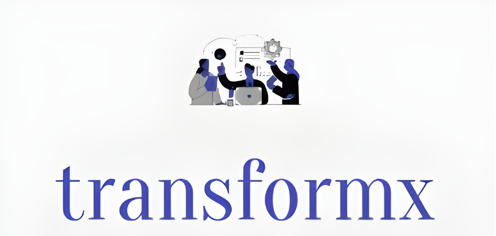

# TransformX Change Management AI Platform

An end-to-end solution for extracting, analyzing, and visualizing change management insights using Azure AI Services, featuring a powerful web scraper backend and an interactive AI-driven ROI calculator frontend.



## 📊 Presentation

[View our project presentation](TransformX%20Presentation.pdf)

## 📋 Table of Contents

- [Overview](#-overview)
- [Features](#-features)
- [System Architecture](#-system-architecture)
- [Installation](#-installation)
- [Backend: Web Scraper](#-backend-web-scraper)
- [Frontend: ROI Calculator](#-frontend-roi-calculator)
- [AI-Powered Features](#-ai-powered-features)
- [Database Structure](#-database-structure)
- [Azure Integration](#-azure-integration)
- [AI Fairness Considerations](#-ai-fairness-considerations)
- [Data Democratization for Change Management](#-data-democratization-for-change-management)
- [Troubleshooting](#-troubleshooting)
- [Future Plans](#-future-plans)
- [Contributors](#-contributors)
- [Acknowledgements](#-acknowledgements)
- [License](#-license)
- [Disclaimer](#-disclaimer)

## 🔍 Overview

This platform combines powerful web scraping capabilities with Azure AI services to help change management professionals assess ROI and make data-driven decisions. The system extracts articles from McKinsey's website, processes the content, and provides an AI-enhanced interface for analyzing change management strategies. The platform leverages Azure's AI capabilities to automate workflows and provide intelligent insights.

While this demonstration is trained on McKinsey change management content, the underlying architecture and methodology are designed to be fully generalizable to other domains, industries, and content sources. The same approach can be applied to extract insights from any specialized knowledge base.

## 🤝 AI Fairness Considerations

Our platform has been developed with careful consideration of the AI Fairness Checklist framework developed by Madaio et al. Here's how we've approached fairness throughout our development process:

### Envision
- **System Purpose and Vision**: We've clearly defined our system's purpose for extracting and analyzing change management insights while considering potential dual uses.
- **Stakeholder Identification**: We've identified key stakeholders including change management professionals, business leaders, and employees affected by change initiatives.
- **Harm Mitigation**: We are currently working on scrutinizing our system for potential fairness-related harms, particularly in how ROI calculations could impact different organizational groups. This remains an important area of ongoing development.

### Define
- **System Architecture**: Our architecture separates the data collection (scraper) from the analysis and visualization components to allow better scrutiny of each part.
- **Dataset Considerations**: We've documented the sources and limitations of our training data, acknowledging potential biases in the McKinsey articles themselves.
- **Fairness Criteria**: If we had more time and resources, we would establish comprehensive criteria for assessing the fairness of our AI-generated recommendations, particularly to ensure they don't disproportionately impact certain employee groups during organizational change.

### Prototype and Build
- **Documentation**: We maintain detailed documentation of our system's capabilities and limitations through this README and additional documentation.
- **Testing**: Due to the capital and time costs of comprehensive bias testing, we relied on Azure AI Foundry Evaluate for cursory, surface-level identification of biases. While this provides initial insights, we acknowledge that more robust and diverse testing is needed for a production-ready system.
- **Transparency**: If we had more time and resources, we would develop more sophisticated methods to present AI-generated insights with appropriate confidence levels and contextual information, including clearer explanations of how recommendations are generated and their potential limitations.

### Launch and Evolve
- **Feedback Mechanisms**: We've designed the system with functionality for users to provide feedback on AI recommendations, though implementation is still in progress.
- **Monitoring**: We've planned for monitoring deviations from expected fairness criteria, which would be implemented in a production environment.
- **Regular Updates**: We recommend periodically reviewing and updating models to reflect changes in societal norms and expectations as part of a responsible AI governance process.

### Economic Fairness and Accessibility
An often overlooked dimension of AI fairness is economic accessibility. We recognize that the high costs of training and fine-tuning AI models create significant barriers for smaller organizations and non-profits who may benefit most from change management insights. This creates a new category of disadvantaged stakeholders – those who are "data poor" or lack the capital to develop and deploy sophisticated AI systems.

We believe more research and industry attention should be directed toward:
- Developing affordable pathways for smaller organizations to benefit from AI advances
- Creating shared resources and pre-trained models that can be adapted at lower cost
- Establishing frameworks for evaluating economic fairness in AI deployment
- Supporting initiatives that democratize access to AI technologies

As part of our commitment to comprehensive fairness, we're exploring ways to make our platform more accessible to organizations with limited resources while maintaining data privacy and security standards.

## 📊 Data Democratization for Change Management

### The Problem of Data Disenfranchisement

A critical challenge in the AI-driven change management landscape is what we call "data disenfranchisement." This phenomenon occurs when:

- **Premium Knowledge Paywalls**: Most high-quality change management case studies, research, and frameworks are locked behind expensive paywalls (like McKinsey, Deloitte, BCG, Harvard Business Review, etc.)
- **Proprietary Case Logs**: Organizations that can afford consultancies accumulate valuable proprietary case logs that aren't accessible to smaller entities
- **Data Advantage Gap**: This creates a widening gap where resource-rich organizations build increasingly powerful AI agents while others fall further behind

The result is a "rich get richer" scenario in organizational knowledge, where those with existing resources can leverage AI most effectively, while resource-constrained organizations - often those who could benefit most from efficiency improvements - cannot access the data needed to create effective AI solutions.

### Our Approach to Data Democratization

This project directly addresses data disenfranchisement through:

1. **Ethical Knowledge Extraction**: Using our scraper to ethically collect publicly available (but difficult to aggregate) change management insights
2. **Knowledge Base Consolidation**: Structuring this information into a standardized, accessible format
3. **Shared AI Infrastructure**: Leveraging Azure's AI capabilities to analyze this knowledge in ways that would be prohibitively expensive for individual small organizations
4. **Accessible Insights Platform**: Providing a user-friendly interface that makes these insights available without requiring expensive AI expertise

### Impact and Vision

By democratizing access to change management knowledge:

- **Smaller Organizations Benefit**: Nonprofits, small businesses, and government agencies gain access to insights previously available only to those with large consulting budgets
- **Innovation Across Sectors**: More diverse organizations can implement effective change management, leading to greater innovation and resilience
- **Reduced Implementation Risk**: Organizations with limited resources can make more informed decisions about change initiatives, reducing costly failures

Our vision is to help bridge the "AI divide" that threatens to exacerbate existing organizational inequalities, ensuring that the benefits of AI-driven change management can be realized across the entire organizational landscape, not just by those with the most resources.

### Areas for Continued Improvement
- Expanding the diversity of our training data beyond McKinsey sources
- Implementing more robust user testing with diverse stakeholders
- Enhancing our documentation of model limitations
- Developing more comprehensive fairness metrics specific to change management contexts
- Creating tiered access models to address economic fairness concerns

By adhering to these fairness principles, we aim to create a system that provides valuable insights while minimizing potential harms to all stakeholders involved in change management processes.

## ✨ Features

### Backend (Scraper)
- Extracts article metadata and full content from McKinsey's website
- Multi-threaded architecture for efficient data collection
- Robust error handling and rate limiting
- Structured data storage in SQLite databases
- CSV export functionality

### Frontend (ROI Calculator)
- Interactive dashboard with key metrics visualization
- Detailed change initiative input form
- Sophisticated ROI calculation engine
- AI-powered chat assistant for analysis help
- Responsive design for all devices

### AI Capabilities
- **AI-Powered Document Processing:**
  - Automated text extraction and processing with LLMs
  - Integration with Azure AI Foundry (GPT-4o)
  - Structured prompts via Azure Prompt Flow
- **Change Management Automation:**
  - AI-based decision support for change impact analysis
  - Automated approval workflows using Azure AI

## 🔨 System Architecture

The platform is built on a cloud-native architecture utilizing Microsoft Azure services:

```
MicrosoftHackMarch2025/
├── scraperv2/               # Enhanced web scraper
│   ├── mckinsey_scraper.py  # Article metadata collection
│   ├── article_parser.py    # Full content extraction
│   └── export_content.py    # CSV export functionality
├── frontend/                # Next.js web application
│   ├── app/                 # Next.js app directory
│   ├── components/          # React components
│   └── public/              # Static assets
└── azure/                   # Azure integration utilities
```

### Azure Services Architecture
- **User Interface:** React.js-based web application hosted on Azure Web Apps
- **Backend Services:** Python FastAPI deployed as an Azure Web App
- **AI Processing:**
  - Azure AI Foundry (GPT-4o LLM) for natural language understanding
  - Azure Prompt Flow for structured AI interactions
- **Data Storage and Management:**
  - Azure Blob Storage for document and output storage
  - Azure SQL DataWarehouse for structured data (hosted on GitHub for demo)
  - Web scrapers (Selenium) for external data collection
- **Security & Networking:**
  - Azure Virtual Network and subnets (planned)
  - Entra Managed Identity for authentication (planned)

## 📦 Installation

### Prerequisites
- Python 3.8+ for the backend
- Node.js 18+ for the frontend
- Chrome/Chromium browser
- Azure account (for AI features)

### Backend Setup

**Option 1: Using conda (recommended)**
```bash
conda env create -f environment.yml
conda activate mckinsey-scraper
```

**Option 2: Manual installation**
```bash
pip install selenium requests beautifulsoup4 SQLAlchemy python-dotenv lxml fake-useragent webdriver-manager
```

### Frontend Setup
```bash
cd frontend/my-app
npm install
cp .env.example .env  # Then edit .env with your API keys
```

## 🔄 Backend: Web Scraper

### Step 1: Collect Article Metadata
```bash
python run_mckinsey_scraper.py --start-page 1 --end-page 5 --workers 3
```

**Parameters:**
- `--start-page` / `-s`: First page to scrape (default: 1)
- `--end-page` / `-e`: Last page to scrape (default: 5)
- `--workers` / `-w`: Number of parallel workers (default: 3)
- `--verbose` / `-v`: Enable detailed output

### Step 2: Extract Article Content
```bash
python article_parser.py --workers 4 --verbose
```

**Parameters:**
- `--limit` / `-l`: Maximum number of articles to process
- `--workers` / `-w`: Number of concurrent workers (default: 1)
- `--verbose` / `-v`: Enable detailed output

### Step 3: Export to CSV
```bash
python export_content_to_csv.py
```

**Parameters:**
- `--database` / `-d`: Path to content database (default: mckinsey_article_content.db)
- `--output` / `-o`: Path to output CSV file (default: mckinsey_articles_export.csv)
- `--no-content`: Exclude article content from CSV export
- `--all-columns`: Include all columns including redundant ones
- `--no-excel-limit`: Export full content without Excel cell size limits

## 💻 Frontend: ROI Calculator

### Tech Stack
- **Next.js**: React framework for server-rendered applications
- **TypeScript**: Type-safe JavaScript
- **Tailwind CSS**: Utility-first CSS framework
- **Radix UI**: Accessible UI components

### Key Features
- **Dashboard**: Overview of active change initiatives, ROI metrics, and employee statistics
- **Change Initiative Form**: Detailed form to input change management parameters
- **ROI Calculator**: Calculates and visualizes return on investment for change initiatives
- **AI-powered Chat**: Integrated assistant to answer questions about ROI calculations

### Running the Frontend
```bash
cd frontend/my-app
npm run dev
```

Visit `http://localhost:3000` to access the application.

### Environment Variables
Create a `.env` file with:
```
AZURE_LLM_KEY=your_azure_llm_key_here
AZURE_API_KEY=your_azure_api_key_here
```

## 🤖 AI-Powered Features

### Document Processing
- Integration with Azure AI Foundry for intelligent content analysis
- Text extraction and classification of change management concepts
- Semantic understanding of article content for improved recommendations

### Conversational Interface
- AI-powered chat assistant for answering questions about change management
- Structured prompts using Azure Prompt Flow for consistent responses
- Context-aware interactions based on uploaded documents and ROI calculations

### Intelligent ROI Analysis
- AI-driven insights into ROI calculations and projections
- Automated detection of key success factors in change initiatives
- Comparison with industry benchmarks extracted from McKinsey articles

## 📁 Database Structure

### mckinsey_articles.db
- **Table**: `articles`
  - `id`: Unique identifier (primary key)
  - `title`: Article title
  - `authors`: Article authors
  - `date`: Publication date
  - `url`: Article URL (unique)
  - `page_number`: Search results page number

### mckinsey_article_content.db
- **Table**: `article_content`
  - `article_id`: Foreign key to articles.id (primary key)
  - `title`: Article title (copy)
  - `authors`: Article authors (copy)
  - `date`: Publication date (copy)
  - `url`: Article URL (copy)
  - `page_number`: Search page number (copy)
  - `content`: Full article text content

## ⛅ Azure Integration

The platform integrates with several Azure services:

1. **Azure AI Foundry Fine Tuning**: Fine tune the LLM using scrapped McKinsey Data 
2. **Azure AI Foundry Prompt Flow**: Processes ROI calculations and document analysis
3. **Azure AI Foundry gtp-4o**: Powers the AI chat assistant and document processing
4. **Azure Key Vault**: Secures API keys and credentials
5. **Azure Blob Storage**: Stores processed documents and AI outputs
6. **Azure SQL DataWarehouse**: Manages structured data (demo on GitHub)
7. **Azure Document Inteligence**: Powers the AI document processing

### Setup
1. Create Azure resources using the Azure Portal or CLI
2. Update environment variables with your Azure credentials
3. Deploy the application using GitHub Actions workflow

## ⚡ Troubleshooting

### WebDriver Issues
- Ensure Chrome version matches ChromeDriver version
- On permission issues: `chmod +x /path/to/chromedriver`
- For headless mode problems, try running with visible browser

### Rate Limiting
- Increase delay between requests
- Reduce worker count
- Use a VPN or proxy service

### Content Formatting Issues
- Check the exported CSV for proper formatting
- If formatting issues persist, adjust regex patterns in the code

### Azure AI Service Issues
- Verify your API keys are correctly configured
- Check Azure service quotas and limits
- Ensure proper CORS configuration for web applications

## 🚀 Future Plans

Several components are planned for future implementation:

1. **Security Enhancements**:
   - Implementing Entra Managed Identity for secure access
   - Deploying a full virtual network with subnet segmentation

2. **AI Improvements**:
   - Enhancing document processing with Azure Document Intelligence
   - Expanding AI fine-tuning capabilities for improved model accuracy
   - Creating domain-specific models for change management

3. **UI Enhancements**:
   - Advanced visualization of change management metrics
   - Customizable dashboards for different user roles
   - Mobile application support

## 👥 Contributors

- [Sarvesh Gade](https://www.linkedin.com/in/sarvesh-gade/)
- [Christine Ine](https://www.linkedin.com/in/christine-ine/)
- [Sambhav Mattoo](https://www.linkedin.com/in/sambhav-mattoo/)
- [Kai Ouyang](https://www.linkedin.com/in/kai-ouyang/)
- [Vijay Sithambaram](https://www.linkedin.com/in/vijay-sithambaram/)

## 👏 Acknowledgements

We extend our gratitude to [Microsoft](https://www.microsoft.com/) for organizing and hosting this Hackathon AI challenge. Their commitment to fostering diversity and innovation in the tech industry has provided us with a valuable opportunity to showcase our skills and develop impactful solutions. We appreciate their support and dedication to empowering individuals and communities through technology.

We also thank [TechBridge](https://techbridge.org/) for their inspiration in connecting technology solutions with meaningful social impact. Their model of helping "tech help people" and focus on breaking the cycle of generational poverty aligns with our vision for accessible, impactful technology.

## 📝 License

MIT License

Copyright (c) 2025 Change Management AI Team

Permission is hereby granted, free of charge, to any person obtaining a copy
of this software and associated documentation files (the "Software"), to deal
in the Software without restriction, including without limitation the rights
to use, copy, modify, merge, publish, distribute, sublicense, and/or sell
copies of the Software, and to permit persons to whom the Software is
furnished to do so, subject to the following conditions:

The above copyright notice and this permission notice shall be included in all
copies or substantial portions of the Software.

THE SOFTWARE IS PROVIDED "AS IS", WITHOUT WARRANTY OF ANY KIND, EXPRESS OR
IMPLIED, INCLUDING BUT NOT LIMITED TO THE WARRANTIES OF MERCHANTABILITY,
FITNESS FOR A PARTICULAR PURPOSE AND NONINFRINGEMENT. IN NO EVENT SHALL THE
AUTHORS OR COPYRIGHT HOLDERS BE LIABLE FOR ANY CLAIM, DAMAGES OR OTHER
LIABILITY, WHETHER IN AN ACTION OF CONTRACT, TORT OR OTHERWISE, ARISING FROM,
OUT OF OR IN CONNECTION WITH THE SOFTWARE OR THE USE OR OTHER DEALINGS IN THE
SOFTWARE.

## ⚠️ Disclaimer

This tool is for educational purposes only. Please respect McKinsey's terms of service when using this software.
